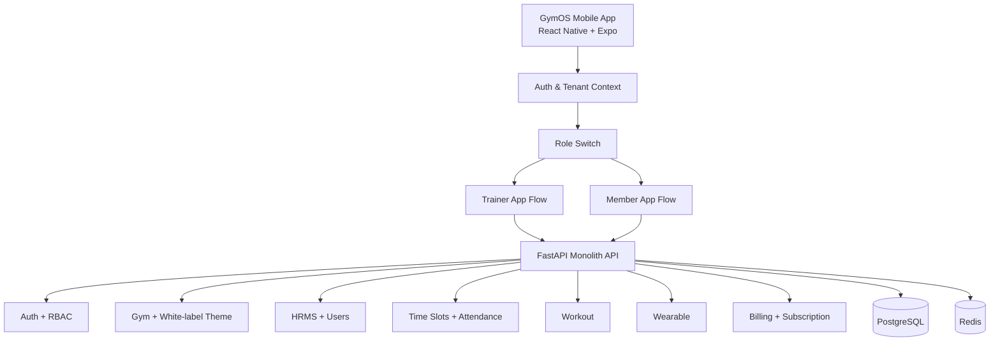
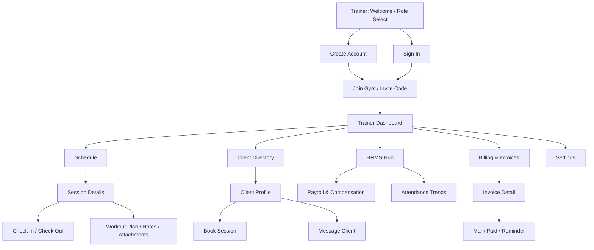
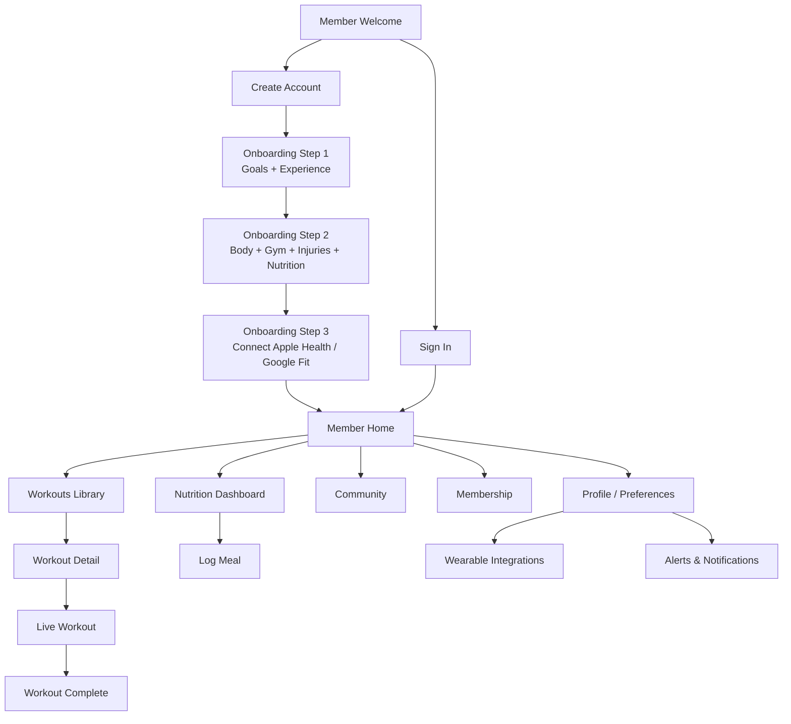

# GymOS Mobile Architecture & Screen Flow Diagram

This document captures the **React Native mobile information architecture** and **screen flows** for both Trainer and Member apps based on the current product plan and design references.

## 1) Mobile App Architecture (High Level)

## 2) Trainer Screen Flow

## 3) Member Screen Flow

## 4) Cross-Cutting Rules (Applied to all screens)

- **Multi-tenant isolation**: every user journey is gym-scoped (`gym_id`).
- **White-label rendering**: theme/logo resolved by tenant context.
- **Role-based access**:
  - Trainer sees assigned members and trainer workspace actions only.
  - Member sees personal data, workouts, attendance, wearables only.
- **Billing states affect access**: trial / active / suspended controls gated experiences.

