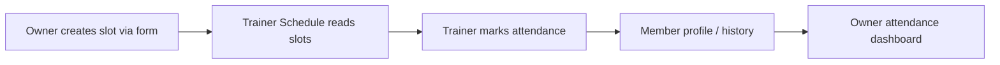
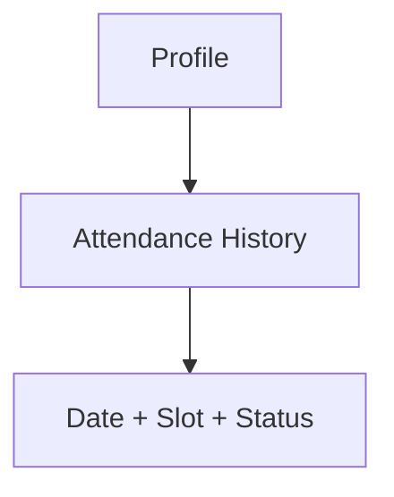
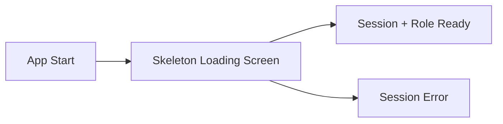

# GymOS Mobile Architecture & Screen Flow Diagram

This document reflects the implemented navigation architecture with role/session bootstrap, API-style hooks, and connected owner → trainer → member flows.

## 1) Architecture (Providers + Hooks + Navigation)

```mermaid
flowchart TB
    A[App.tsx] --> B[RoleProvider]
    B --> C[ThemeProvider]
    C --> D[AppNavigator]

    B --> API[/services/api.ts]
    D --> H1[/hooks/useAuth.ts]
    D --> H2[/hooks/useSlots.ts]
    D --> H3[/hooks/useAttendance.ts]
    D --> H4[/hooks/useRoster.ts]

    D --> NAV[Root Stack + Role Tabs]
```

## 2) Gym Owner Flow


## 3) Connected Operational Flow



## 4) Member Attendance Flow



## 5) Loading UX



## 6) Notes

- Role and user identity are session-driven (not hardcoded per screen).
- Ops state is now API-hook structured (`services` + `hooks`) and ready for backend replacement.
- Custom tabs are kept for now; can be swapped to `@react-navigation/bottom-tabs` later.
