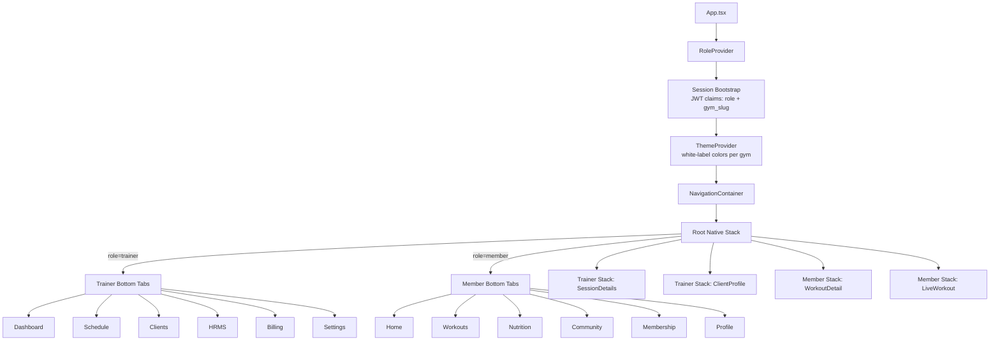
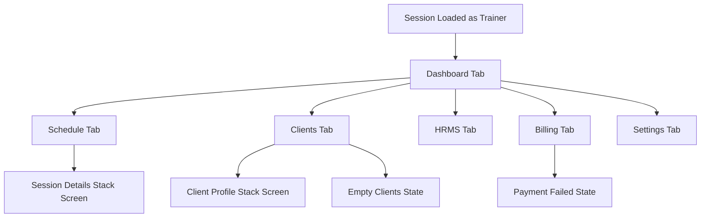
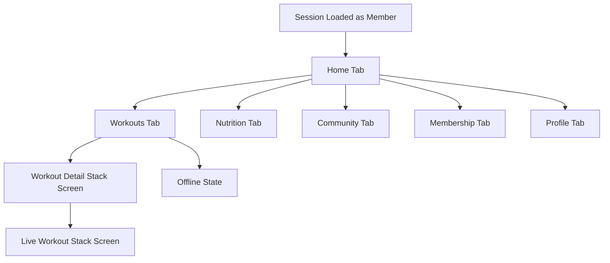
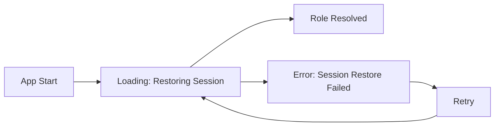

# GymOS Mobile Architecture & Screen Flow Diagram

This document reflects the implemented navigation architecture using **React Navigation (Native Stack + Bottom Tabs)** and role bootstrapping from session/JWT claims.

## 1) Mobile Architecture (Stack + Tabs)

## 2) Trainer Screen Flow

## 3) Member Screen Flow

## 4) Global UX States

## 5) Rules

- Role selection in production comes from backend JWT claims (`role`) and tenant context (`gym_slug`).
- White-label theme is injected via `ThemeProvider` (dynamic token map per gym).
- Empty, error, and offline states are first-class UX states in relevant screens.
