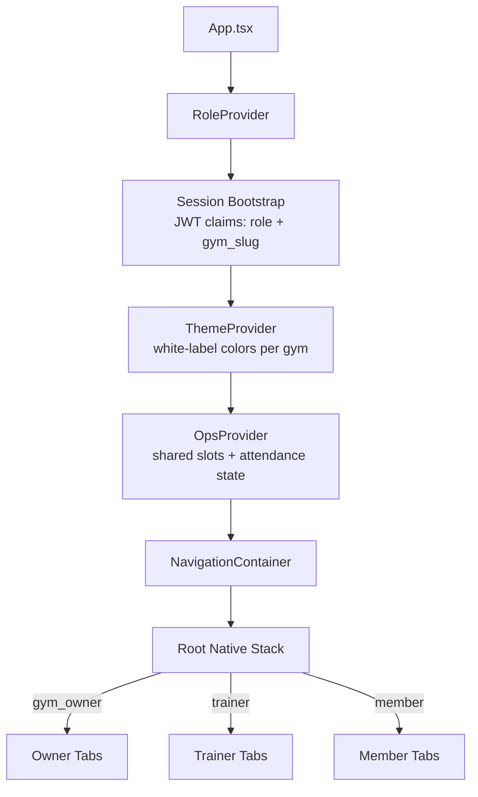
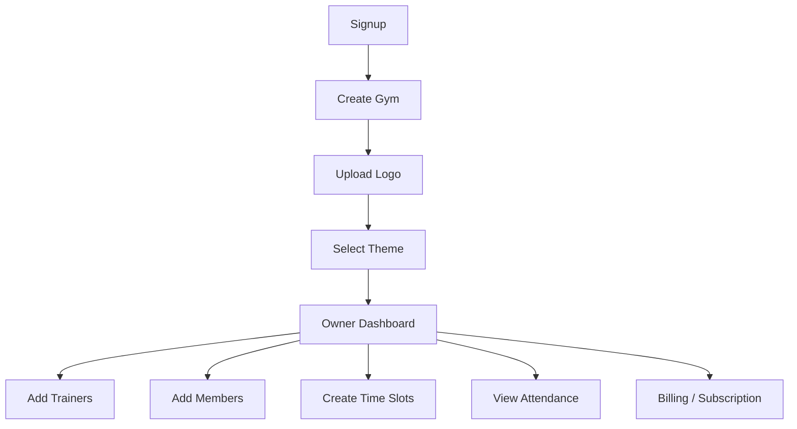
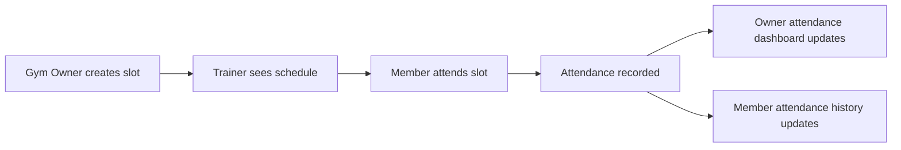
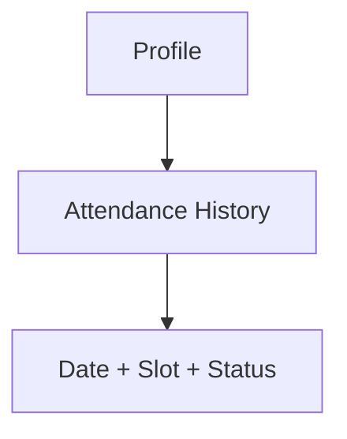
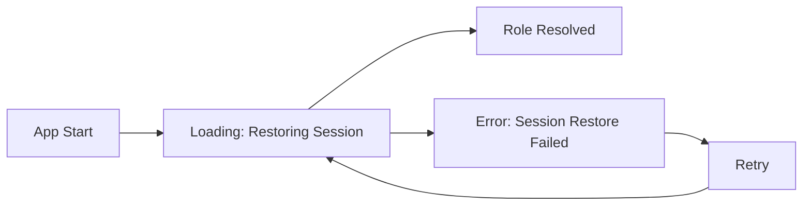

# GymOS Mobile Architecture & Screen Flow Diagram

This document reflects the implemented navigation architecture using **React Navigation (Native Stack + Bottom Tabs)** and role bootstrapping from session/JWT claims.

## 1) Mobile Architecture (Stack + Tabs)

## 2) Gym Owner Flow (Top Priority)

## 3) Connected Operational Flow

## 4) Member Attendance Flow

## 5) Global UX States

## 6) Rules

- Role in production comes from backend JWT claims (`gym_owner`, `trainer`, `member`).
- White-label theme is injected via `ThemeProvider` (dynamic token map per gym).
- Flows are connected via shared operational state: slots and attendance updates propagate across owner/trainer/member screens.
